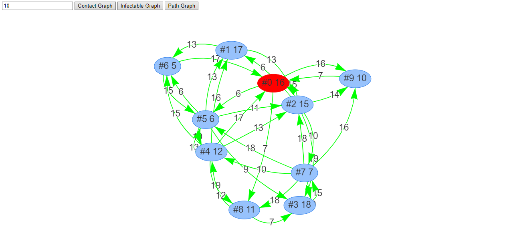
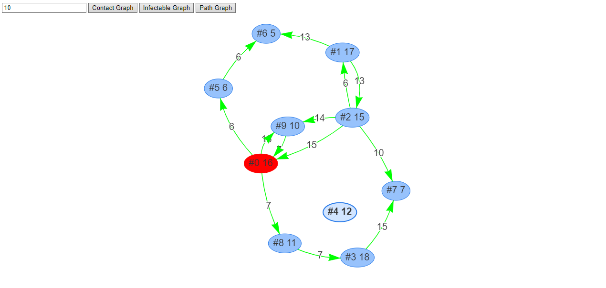
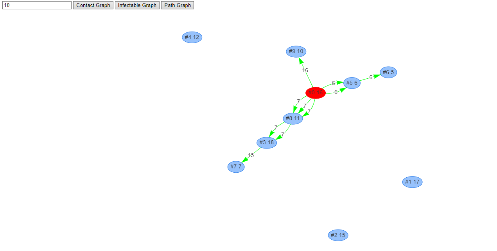

Disease modelling using graph algorithms.

**Research**: [Infectious Disease Modeling], Monsoon 2020 
**Guided by**: Prof. Kishore Kothapalli, Prof. Sriram Pemmaraju

This is based on a reduction of SIR model to a shortest path problem
in a graph, considering each vertex as a person with a certain recovery
time. The edge weights denote average time its takes for infection.
See [SIR-SSSP.pdf] for details.

- **Contact Graph**: Includes all people.
- **Infectable Graph**: Includes only people who can be infected (local check).
- **Path Graph**: Shows time taken for a person to get infected.

 
 
 

[Infectious Disease Modeling]: https://github.com/iiithf/infectious-disease-modeling
[SIR-SSSP.pdf]: SIR-SSSP.pdf
